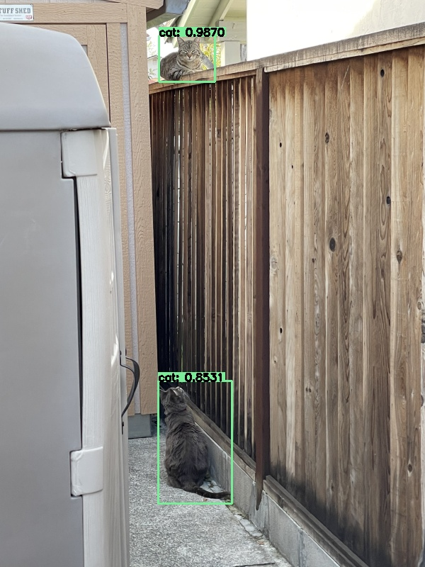

# CritterCam

> Critter surveillance for your backyard

## Why?

I came up with the idea for this project when I discovered a stray cat had been sneaking into my home to eat my pet cat's food. Not wanting to spook the critter, or wait around for it to come back, I devised a plan for this deep learning powered security system.

## How?

CritterCam relies on the DNN module of OpenCV and Darknet's YOLO for real-time object detection. However, in order to reduce unnecessary computation, it also makes use of background subtraction, and YOLO is only used when motion is detected. CritterCam also makes use of Jeff Bass's ImageZMQ in order to make use of multiple camera sources, such as Raspberry Pis or other SBC's. Lastly, the Twilio API is used in order to send and receive motion when an object is detected.

## Quickstart

### Install Python dependencies

Run the following command in the terminal:
`pip install -r requirements.txt`.

## Run

Start the main program with the following command:

`python -m crittercam`

Next, run the companion script on one ore more Raspberry Pis:

`python client.py`

## Enjoy

